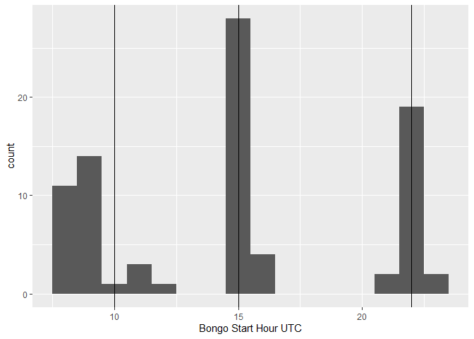
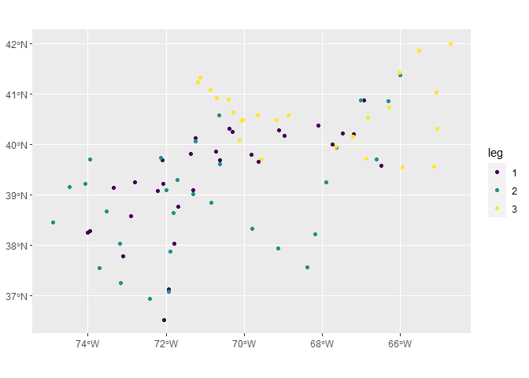
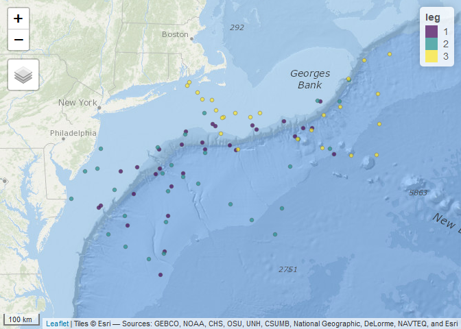
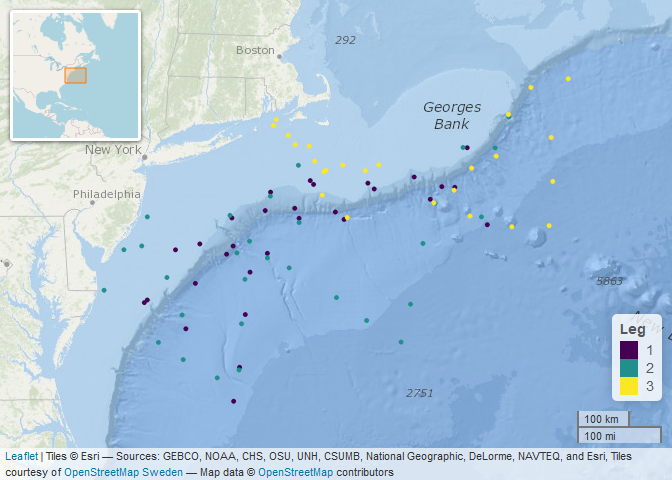

Cleangind Bongo Data
================

This work flow describes how I cleaned bongo data from an AMAPPS
ship-based survey (summer, 2011).

Libraries

``` r
library(tidyverse)
library(lubridate)
library(sf)
library(tmap)
```

Read in data. Some cleaning was done in Excel before hand to fix
observations where data had shifted to incorrect columns.

``` r
dta_bg <- read_csv("data/bongo_2011_HB03_edit.csv")
```

Show the column names and double check data formats.

``` r
glimpse(dta_bg)
```

    ## Rows: 2,806
    ## Columns: 75
    ## $ opsid                        <chr> "2011003HB", "2011003HB", "2011003HB",...
    ## $ zplk_pk_seq                  <dbl> 529040, 529046, 529041, 529047, 529043...
    ## $ taxa_004                     <dbl> 101, 102, 103, 104, 105, 135, 138, 143...
    ## $ cruise_name                  <chr> "HB1103", "HB1103", "HB1103", "HB1103"...
    ## $ station                      <dbl> 1, 1, 1, 1, 1, 1, 1, 1, 1, 1, 1, 1, 1,...
    ## $ event_number                 <dbl> 11, 11, 11, 11, 11, 11, 11, 11, 11, 11...
    ## $ net_number                   <dbl> 2, 2, 2, 2, 2, 2, 2, 2, 2, 2, 2, 2, 2,...
    ## $ zoo_aliquot                  <dbl> 256, 256, 256, 256, 256, 256, 256, 256...
    ## $ zooplankton_count            <dbl> 195, 77, 22, 41, 16, 2, 2, 1, 2, 1, 17...
    ## $ conc_10m2                    <dbl> 217923.57, 86051.87, 24586.25, 45819.8...
    ## $ conc_100m3                   <dbl> 22466.35, 8871.33, 2534.66, 4723.69, 1...
    ## $ vial_number                  <dbl> 1, 2, 3, 3, 3, 3, 3, 3, 3, 3, 5, 5, 5,...
    ## $ zoo_stage_000                <dbl> 25, 69, 14, 29, 7, 2, NA, 1, 2, NA, NA...
    ## $ zoo_stage_013                <dbl> 0, 0, 0, 0, 0, 0, NA, 0, 0, NA, NA, NA...
    ## $ zoo_stage_020                <dbl> 0, 0, 0, 0, 0, 0, NA, 0, 0, NA, NA, NA...
    ## $ zoo_stage_021                <dbl> 8, 0, 0, 0, 0, 0, NA, 0, 0, NA, NA, NA...
    ## $ zoo_stage_022                <dbl> 41, 0, 0, 0, 0, 0, NA, 0, 0, NA, NA, N...
    ## $ zoo_stage_023                <dbl> 42, 0, 3, 1, 2, 0, NA, 0, 0, NA, NA, N...
    ## $ zoo_stage_024                <dbl> 79, 8, 5, 11, 7, 0, NA, 0, 0, NA, NA, ...
    ## $ zoo_stage_028                <dbl> 0, 0, 0, 0, 0, 0, NA, 0, 0, NA, NA, NA...
    ## $ zoo_stage_029                <dbl> 0, 0, 0, 0, 0, 0, NA, 0, 0, NA, NA, NA...
    ## $ zoo_stage_030                <dbl> 0, 0, 0, 0, 0, 0, NA, 0, 0, NA, NA, NA...
    ## $ zoo_stage_050                <dbl> 0, 0, 0, 0, 0, 0, NA, 0, 0, NA, NA, NA...
    ## $ zoo_stage_051                <dbl> 0, 0, 0, 0, 0, 0, NA, 0, 0, NA, NA, NA...
    ## $ zoo_stage_054                <dbl> 0, 0, 0, 0, 0, 0, NA, 0, 0, NA, NA, NA...
    ## $ zoo_stage_999                <dbl> 0, 0, 0, 0, 0, 0, NA, 0, 0, NA, NA, NA...
    ## $ net_pk_seq                   <dbl> 72511, 72511, 72511, 72511, 72511, 725...
    ## $ gear                         <chr> "6B3Z", "6B3Z", "6B3Z", "6B3Z", "6B3Z"...
    ## $ gear_volume_filtered         <dbl> 222.199, 222.199, 222.199, 222.199, 22...
    ## $ sample_jar_count             <dbl> 1, 1, 1, 1, 1, 1, 1, 1, 1, 1, 1, 1, 1,...
    ## $ sample_type                  <chr> "Z", "Z", "Z", "Z", "Z", "Z", "Z", "Z"...
    ## $ sample_split_factor          <lgl> NA, NA, NA, NA, NA, NA, NA, NA, NA, NA...
    ## $ flowmeter_calibration_factor <dbl> 0.3141, 0.3141, 0.3141, 0.3141, 0.3141...
    ## $ flowmeter_revolutions        <dbl> 2421, 2421, 2421, 2421, 2421, 2421, 24...
    ## $ preservative                 <chr> "F5", "F5", "F5", "F5", "F5", "F5", "F...
    ## $ flag_season                  <dbl> 1, 1, 1, 1, 1, 1, 1, 1, 1, 1, 1, 1, 1,...
    ## $ flag_flowmeter_diff          <lgl> NA, NA, NA, NA, NA, NA, NA, NA, NA, NA...
    ## $ flag_depth                   <dbl> NA, NA, NA, NA, NA, NA, NA, NA, NA, NA...
    ## $ flag_region                  <dbl> 1, 1, 1, 1, 1, 1, 1, 1, 1, 1, 1, 1, 1,...
    ## $ flag_clogging                <chr> "N", "N", "N", "N", "N", "N", "N", "N"...
    ## $ flag_zoo_analyzed            <chr> "I", "I", "I", "I", "I", "I", "I", "I"...
    ## $ flag_eggs_analyzed           <lgl> NA, NA, NA, NA, NA, NA, NA, NA, NA, NA...
    ## $ flag_ichthyo_analyzed        <lgl> NA, NA, NA, NA, NA, NA, NA, NA, NA, NA...
    ## $ flag_sample_intact           <chr> "Y", "Y", "Y", "Y", "Y", "Y", "Y", "Y"...
    ## $ net_comment                  <chr> "Manual Load Prgm.", "Manual Load Prgm...
    ## $ bio_volume_zoo_quick         <lgl> NA, NA, NA, NA, NA, NA, NA, NA, NA, NA...
    ## $ event_pk_seq                 <dbl> 69979, 69979, 69979, 69979, 69979, 699...
    ## $ operation                    <chr> "BON/CTD", "BON/CTD", "BON/CTD", "BON/...
    ## $ event_date                   <time> 09:07:00, 09:07:00, 09:07:00, 09:07:0...
    ## $ formated_event_date          <chr> "6/4/2011 9:07", "6/4/2011 9:07", "6/4...
    ## $ latitude                     <dbl> 40.2717, 40.2717, 40.2717, 40.2717, 40...
    ## $ longitude                    <dbl> -69.0650, -69.0650, -69.0650, -69.0650...
    ## $ survey_period                <lgl> NA, NA, NA, NA, NA, NA, NA, NA, NA, NA...
    ## $ survey_period_nvl            <chr> ".", ".", ".", ".", ".", ".", ".", "."...
    ## $ region                       <chr> "SNE", "SNE", "SNE", "SNE", "SNE", "SN...
    ## $ region_nvl                   <chr> "SNE", "SNE", "SNE", "SNE", "SNE", "SN...
    ## $ plankton_stratum             <dbl> 23, 23, 23, 23, 23, 23, 23, 23, 23, 23...
    ## $ groundfish_stratum           <dbl> 1100, 1100, 1100, 1100, 1100, 1100, 11...
    ## $ surface_temperature          <dbl> 12, 12, 12, 12, 12, 12, 12, 12, 12, 12...
    ## $ surface_temperature_nvl      <dbl> 12, 12, 12, 12, 12, 12, 12, 12, 12, 12...
    ## $ tow_profile                  <chr> "OBL", "OBL", "OBL", "OBL", "OBL", "OB...
    ## $ tow_protocol                 <chr> "OT", "OT", "OT", "OT", "OT", "OT", "O...
    ## $ tow_maximum_depth            <dbl> 97, 97, 97, 97, 97, 97, 97, 97, 97, 97...
    ## $ bottom_depth_max_wire_out    <dbl> 101, 101, 101, 101, 101, 101, 101, 101...
    ## $ event_comment                <chr> "Manual Load Prgm.", "Manual Load Prgm...
    ## $ bio_volume_zoo               <dbl> 48, 48, 48, 48, 48, 48, 48, 48, 48, 48...
    ## $ bio_volume_zoo_1m2           <dbl> 20.95, 20.95, 20.95, 20.95, 20.95, 20....
    ## $ bio_volume_zoo_100m3         <dbl> 21.60, 21.60, 21.60, 21.60, 21.60, 21....
    ## $ bio_volume_large_conc_1m2    <dbl> NA, NA, NA, NA, NA, NA, NA, NA, NA, NA...
    ## $ bio_volume_large_conc_100m3  <dbl> NA, NA, NA, NA, NA, NA, NA, NA, NA, NA...
    ## $ total_zoo_count              <dbl> 652, 652, 652, 652, 652, 652, 652, 652...
    ## $ total_large_zoo_count        <dbl> NA, NA, NA, NA, NA, NA, NA, NA, NA, NA...
    ## $ total_large_zoo_length       <lgl> NA, NA, NA, NA, NA, NA, NA, NA, NA, NA...
    ## $ large_zoo_mean_length        <lgl> NA, NA, NA, NA, NA, NA, NA, NA, NA, NA...
    ## $ taxa_name                    <chr> "Calanus finmarchicus", "Pseudocalanus...

Initial cleaning:  
\- Put `formated_event_date` in datetime format  
\- Add a `Date` column  
\- Arrange the data by datetime  
\- Add `leg` column as a factor

``` r
dta_bg <- dta_bg %>% 
  mutate(DT_UTC = mdy_hm(formated_event_date), tz = "UTC",
         Date = date(mdy_hm(formated_event_date))) %>%
  arrange(DT_UTC) %>% # to put in time-order
  mutate(leg = factor(case_when(Date <= ymd("2011-06-22") ~ 1,
                                Date >= ymd("2011-06-27") & Date <= ymd("2011-07-15") ~ 2,
                                Date >= ymd("2011-07-20") ~ 3)))
```

Quick summary of stations per leg

``` r
dta_bg %>%
  group_by(leg) %>%
  summarize(`Number of Stations per Leg` = n_distinct(station)) %>%
  ungroup() %>% 
  knitr::kable()
```

| leg | Number of Stations per Leg |
| :-- | -------------------------: |
| 1   |                         30 |
| 2   |                         30 |
| 3   |                         25 |

Bongo tows were conducted every day before the start of line transect
survey effort, before lunch, and after line transect survey effort. The
start of survey effort was approximately 0600h local (1000h UTC).
Breaking for lunch was approximately 1130h local (1530 UTC). The end of
daily effort was approximately 1800h local (2200 UTC).

``` r
dta_bg %>%
  mutate(hr = hour(DT_UTC)) %>%
  group_by(station) %>%
  summarize(hr_start = first(hr)) %>%
  ggplot(aes(hr_start)) + geom_histogram(binwidth = 1) +
  geom_vline(xintercept = c(10, 15, 22)) +
  xlab("Bongo Start Hour UTC")
```

<!-- -->

Observations in the data are by species. This adds in information about
the functional groups.

``` r
functional_groups <- read_csv("data/plankton_functional_groups.csv")
```

    ## Parsed with column specification:
    ## cols(
    ##   taxa_name = col_character(),
    ##   functional_group = col_character(),
    ##   notes = col_character()
    ## )

``` r
dta_bg_jn <- dta_bg %>%  
  left_join(functional_groups, by = "taxa_name")

dta_bg_jn %>% 
  count(functional_group) %>% 
  knitr::kable()
```

| functional\_group |    n |
| :---------------- | ---: |
| Calanus           |  191 |
| Centropages       |  148 |
| Chaetognaths      |  108 |
| crap              |   19 |
| Euphausiids       |  113 |
| fish              |   51 |
| gelatinous        |  233 |
| OIT               |  504 |
| Other copepods    | 1359 |
| Pteropod          |   80 |

Let’s take a look at where the bongo stations occurred, but first let’s
double check that all observations within a station have the same
latitude and longitude.

``` r
dta_bg %>% 
  count(station, latitude, longitude) %>% 
  duplicated() %>% 
  sum()
```

    ## [1] 0

Okay, there are no duplicate stations numbers with the combination of
`station`, `latitude`, and `longitude`.

Now let’s see where the stations are, colored by leg. I’m going to add a
little jitter in case there is spatial overlap.

``` r
bg_stn <- dta_bg %>%
  select(leg, station, DT_UTC, latitude, longitude) %>%
  group_by(station) %>%
  summarize(leg = first(leg), DT = first(DT_UTC), lat = first(latitude), lon = first(longitude))

bg_stn_sp <- bg_stn %>%
  select(leg, station, DT, lat, lon) %>%
  st_as_sf(coords = c("lon", "lat"), crs = 4326)

bg_jitter <- st_jitter(bg_stn_sp, amount = .08)

ggplot() +
  geom_sf(data = bg_jitter, aes(color = leg)) +
  scale_color_viridis_d()
```

<!-- -->

It looks like there are some areas where stations overlapped. Let’s add
a basemap to give the stations geographic context.

``` r
tmap_mode("view")
```

    ## tmap mode set to interactive viewing

``` r
tm_basemap("Esri.OceanBasemap") +
  tm_shape(bg_jitter) +
  tm_dots(size = .03, alpha = 0.7, col = "leg",  palette = "viridis") +
  tm_scale_bar(position = c("left", "bottom"))
```

<!-- -->

… And because I wanted to learn how to use leaflet…

``` r
library(leaflet)

# start basemap
map_base <- leaflet(options = leafletOptions(zoomControl = FALSE,
                                             zoomSnap = 0.1)) %>% 
  # add ocean basemap
  addProviderTiles(providers$Esri.OceanBasemap) %>%
  
  # add another layer with place names
  addProviderTiles(providers$Hydda.RoadsAndLabels, group = 'Place names') %>%
  
  # add a map scalebar
  addScaleBar(position = 'bottomright')


pal <- colorFactor(palette = "viridis", levels = unique(bg_jitter$leg))

map_base %>% 
  addCircles(data = bg_jitter,  
             color = ~pal(leg),
             weight = 3,
             opacity = 1,
             fillColor  = ~pal(leg),
             fillOpacity = 1 ) %>% 
  addLegend(data = bg_jitter, 
            pal = pal, 
            values = ~leg,
            opacity = 1,
            title = "Leg",
            position = "bottomright") %>% 
  addMiniMap(position = "topleft", width = 125, height = 125)
```

<!-- -->
